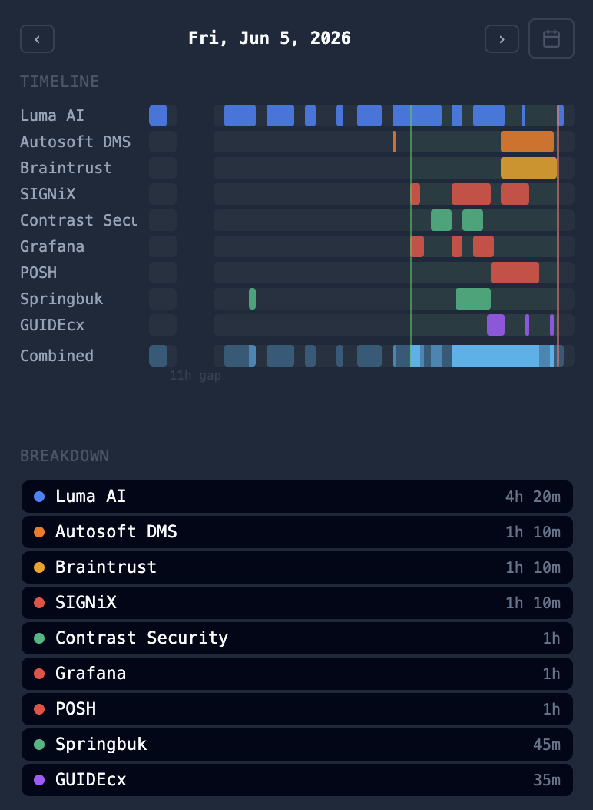

# Changelog

Notable changes for the QA Wolf userscripts install channel.

## Investigation Notes v1.770

- Various improvements and bug fixes.

## Investigation Notes v1.635

- Fixed calendar picker in the Work tab opening unreliably; the entire button now opens the date picker on the first click.

## Investigation Notes v1.634

- **Daily Work tab rebuilt as a swimlane timeline.** Each client gets a horizontal track; activity windows are shown as colored segments. A combined heat row at the bottom shows overlap intensity across clients.
- **Smart gap handling.** Sessions separated by more than 1 hour split into independent segments with a gap label. Short gaps ≤ 10 minutes within a session are bridged visually so fragmented activity reads as one continuous block.
- **Investigation shift markers.** Green/red vertical lines mark shift start and end, drawn from shift history so past days show markers too.
- **Responsive and scrollable.** Track width adapts to panel width; client names stay pinned while the chart body scrolls on narrow panels. Hover crosshair shows a time label that escapes panel clipping.
- Bug fix: case modal notes no longer disappear when closing with Escape or clicking the backdrop.
- Bug fix: investigation shift chip now shows a depleting fill bar — starts full green, drains as time passes, turns orange/red near the end.
- Bug fix: `expect(locator).toBeHidden() failed` log rows now parse correctly instead of producing `<<hidden|expected>>`.
- Bug fix: clipboard always gets raw log text when using Copy on a run log row; parsed text is inserted into the note on click.
- Bug fix: helper files now appear in the Discover tab under a "Helper" filter.

## Investigation Notes v1.620

- Coverage plan table: row checkboxes, bulk column toggles, inline flow names, tracker/Loom/attach header actions, simple vs table checklist modes, and Mark as Done gated on all rows.
- Coverage request pages: compact Coverage page info floating panel (channels, storage, client notes, tracker/Loom/related flows) instead of the full notes drawer.
- No-file / waiting-for-file panel: icon tab bar matches the normal drawer; only Notes and History show file-specific empty states; other tabs work normally.
- Speed dial: coverage-page info icon, drag-without-stuck-click, and reliable reopen after closing the floating panel.

## Investigation Notes v1.604

- Coverage request helper: added optional custom checks for request-specific todos, including a one-click "Reach out to client for clarification" check.
- Fixed coverage helper private notes stealing focus from the QA Wolf coverage request editor during re-renders.

## Investigation Notes v1.603

- Coverage request checklist: renamed top-level tracker item, optional per-reference-flow subchecklists (tracker + Loom per flow), and completion logic that respects both simple and per-flow modes.

## Investigation Notes v1.602

- Prevented stale cross-tab shift bridge state from resurrecting an ended investigation shift, which could make the Creation/Investigation chip bounce after a quick start/end.
- Added regression coverage for stale GM shift bridge state losing to newer local shift metadata.

## Investigation Notes v1.601

- Added CI checks for tests, TypeScript checking, and builds.
- Changed public install publishing so normal releases wait until midnight Eastern Time; merged PRs with the `hotfix` label publish immediately.
- Added safe-mode pause/resume behavior for Notes and Chime without requiring a reload.
- Reduced runtime work from broad observers and polling on busy QA Wolf pages.
- Added debug-gated diagnostics and a Copy diagnostics action in Notes settings.
- Added focused regression tests for URLs, facets, LLM models, shift normalization, chime formatting, run-log parsing, and storage loading.

## Earlier History

Older feature history is tracked in `ideas.md` in the private source repo.
